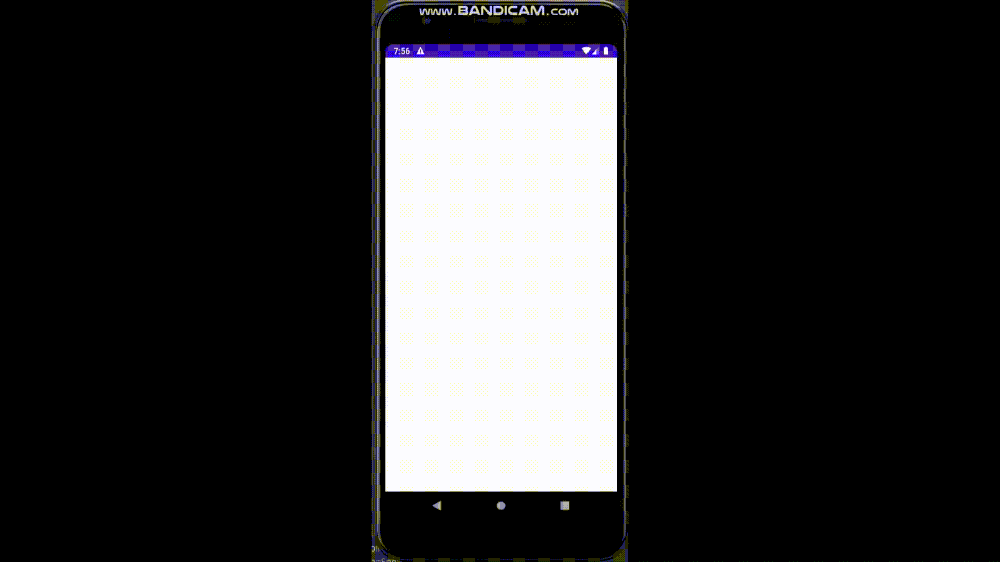
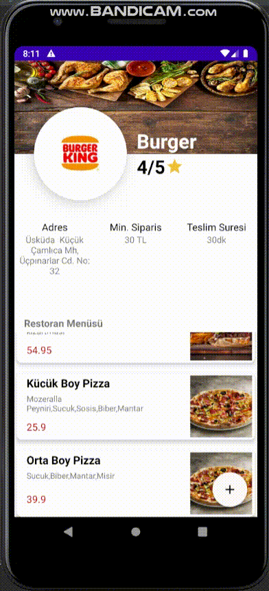
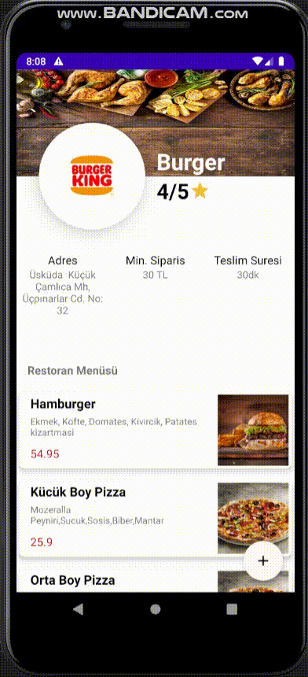

# Yahni Food

This is an basic food delivery application which was developed for Kodluyoruz Yemeksepeti Android Bootcamp.
## Libraries
- Dagger&Hilt
- Retrofit
- OkHttp
- Navigation Component
- Glide 
- Coroutines
- View Pager 2
- Expandable Layout

## How to run the app
Since we used json server for storing data,first things you have to do is that installing json-server with the following command:
```
npm install -g json-server
```
Then, you need to watch the database.json file that we provide you on server file
```bash
json-server --watch database.json
```
## Splash,OnBoarding,Login and Register Screen

## Food Adding Screen

## Food Ordering Screen

## Team
- Hilal Malta
- Nermin Kemancı
- Yusuf Gökmen Arısoy
- Furkan Kanber
- Ahmet Gültekin
